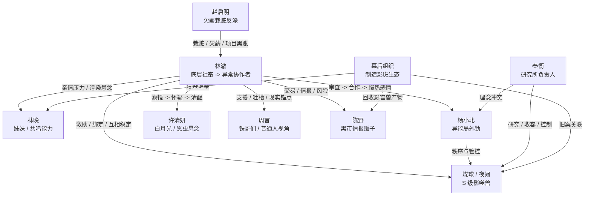

# 人物关系与冲突网

版本：2026-04-28

## 一、核心关系图

## 二、人物功能表

| 人物 | 表层关系 | 核心冲突 | 剧情功能 |
|---|---|---|---|
| 林澈 | 主角 | 生存压力和异常世界夹击 | 判断、布局、反击、承担代价 |
| 煤球 | 流浪黑猫 / 伙伴 | 被争夺、被恐惧、会失控 | 发现恶意、吐出返还物、制造猫味 |
| 林晚 | 妹妹 | 病情是否与污染有关 | 亲情动力、长期悬念、共鸣能力入口 |
| 杨小北 | 异能局外勤 | 保护城市和尊重煤球之间摇摆 | 秩序入口、规则压力、慢热感情线 |
| 许清妍 | 白月光 | 愿虫是否让林澈误判感情 | 情感信息差、主角清醒线 |
| 周言 | 铁哥们 | 普通人被卷入异常 | 现实支援、轻喜剧、普通人视角 |
| 陈野 | 黑市情报贩子 | 贪财自保和讲规矩之间拉扯 | 交易入口、情报入口、风险提示 |
| 秦衡 | 研究所负责人 | 收容危险是否高于个体选择 | 高层压力、理念反派、煤球争夺 |
| 赵启明 | 前主管 | 栽赃林澈以自保获利 | 第一轮打脸、现实恶意样本 |

## 三、主要冲突层

生存冲突：

1. 林澈被裁、欠薪、背锅。
2. 妹妹医药费压迫。
3. 房租、黑心机构、现实小人持续逼近。

能力冲突：

1. 煤球能吞恶意，但会虚弱和失控。
2. 林澈能用技能毛球，但有反噬。
3. 影晶值钱，也会暴露位置。

权属冲突：

1. 林澈认为煤球是伙伴。
2. 杨小北前期认为煤球是高危异常。
3. 秦衡认为 S 级异能兽必须被研究和收容。
4. 黑市认为煤球是可变现资源。

情感冲突：

1. 林澈对许清妍有滤镜。
2. 愿虫会放大好感、愧疚和保护欲。
3. 杨小北的信任来自并肩作战，不来自暧昧套路。
4. 林澈最终要从执念走向清醒选择。

主线冲突：

1. 煤球为什么重伤流浪。
2. 谁在回收影噬兽产物。
3. 林晚为什么被污染。
4. 异能局内部是否隐瞒了三年前旧案。

## 四、关系推进原则

林澈和煤球：

1. 前期像收留者和被收留的猫，林澈救它，它帮林澈翻身。
2. 中期像搭档，林澈尊重它的选择，煤球信任林澈的判断。
3. 后期互相拯救，林澈稳定煤球，煤球揭开林澈和林晚的命运。

林澈和杨小北：

1. 初见：审查和防备。
2. 卷一：临时合作，互相试探。
3. 中期：共同处理异常，信任建立。
4. 后期：理念并肩，感情自然升级。

林澈和许清妍：

1. 初期：滤镜和旧情。
2. 中期：愿虫线露出，感情变复杂。
3. 后期：林澈区分真实感情和异常影响。

林澈和周言：

1. 前期：借钱、藏猫、跑腿。
2. 中期：拍到异常边角料，卷入主线。
3. 后期：作为普通人锚点，提醒林澈不要只剩异常世界。

## 五、冲突写作禁区

1. 不让杨小北为了恋爱放弃职业判断。
2. 不把许清妍写成单薄绿茶，先保留人性复杂度。
3. 不让周言变成只会搞笑的挂件。
4. 不让陈野无成本提供答案。
5. 不让秦衡只喊口号，他要有能说服部分人的逻辑。
